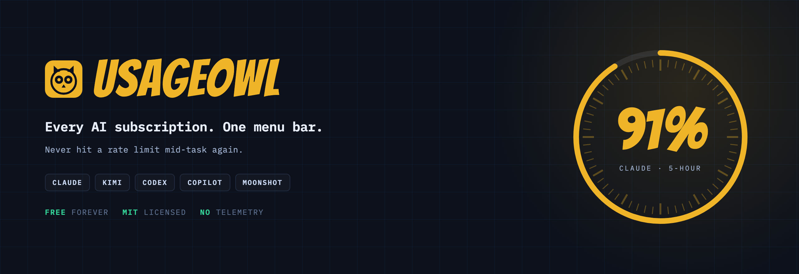

<p align="center">
  
</p>

<p align="center">
  <a href="https://github.com/usageowl/usageowl/releases/latest"></a>
  <a href="LICENSE"></a>
  
  
  
</p>

# UsageOwl

**Every AI subscription. One menu bar.**

UsageOwl is a free, open-source macOS menu bar app that tracks your usage limits across AI coding subscriptions — so you never hit a rate limit mid-task again.

- Website: [usageowl.com](https://usageowl.com)
- License: [MIT](LICENSE)
- Requirements: macOS 14+, Apple Silicon or Intel

## Supported providers

| Provider | What it shows | How it authenticates |
| --- | --- | --- |
| **Claude** (Claude Code / claude.ai) | 5-hour + weekly windows, plan, monthly API-equivalent spend | Reads Claude Code's Keychain entry; optional one-time claude.ai sign-in for extra windows |
| **Kimi** (Kimi Code) | Weekly quota, 5-hour rate window, membership level | Reads Kimi Code CLI's local login (`~/.kimi-code`) |
| **Codex** (ChatGPT Plus/Pro) | Primary/secondary rate windows, plan | Reads Codex CLI's local login (`~/.codex`) |
| **GitHub Copilot** | Premium interactions quota, reset date | GitHub token (pasted once, or from `~/.config/github-copilot`) |
| **Moonshot / Kimi Platform** | Pay-as-you-go balance | API key (pasted once) |

Missing your provider? See [docs/PROVIDERS.md](docs/PROVIDERS.md) — adding one is a single Swift file. PRs welcome.

## Features

- **Menu-bar native** — a tiny ring gauge shows your most-consumed quota; one click for the full picture
- **Threshold notifications** at 25%, 50%, 75%, and 90% of each window
- **Reset countdowns** — know exactly when every window refreshes
- **Spend** — what this month's Claude Code work would cost at API list rates, priced per model from your local transcripts. Shown separately from money actually charged, because a flat-rate subscription isn't a bill
- **Auto-detect** — uses the logins your AI CLIs already created; no cookie spelunking
- **Privacy first** — no analytics, no telemetry, no servers. Credentials never leave your Mac
- **Update checks** — asks GitHub Releases once a day whether a newer build exists, and always asks you before anything downloads. Nothing about you is sent; it's an anonymous request for a public file. Turn it into a manual-only check by using **Settings → Updates → Check Now** and ignoring the prompt
- **Lightweight** — native Swift, under 5 MB

## Install

Download the latest notarized release from [Releases](../../releases) or [usageowl.com](https://usageowl.com), unzip, and move `UsageOwl.app` to `/Applications`.

> Distributed outside the App Store on purpose: App Store sandboxing cannot read the local CLI credential files that make auto-detection work. Releases are signed and notarized with an Apple Developer ID.

## Build from source

Requires Xcode 15+ command line tools on macOS 14+.

```bash
cd app
./build_app.sh        # produces app/dist/UsageOwl.app
open dist/UsageOwl.app
```

The website is a static Next.js export:

```bash
cd website
npm install
npm run dev           # develop
npm run build         # exports static site to website/out/
```

## How it works

UsageOwl polls the official quota/usage endpoints of each provider using the tokens your CLI tools already stored locally (e.g. `~/.kimi-code/credentials/kimi-code.json`, `~/.codex/auth.json`, the `Claude Code-credentials` Keychain item). Pasted tokens are stored in your Keychain. Everything stays on-device. See [docs/PROVIDERS.md](docs/PROVIDERS.md) for the full endpoint reference.

## Roadmap

- Global hotkey to summon the popup
- More providers (Cursor, Gemini/Antigravity, Zed, Windsurf, OpenRouter, DeepSeek)
- History graphs and burn-rate forecasting
- Homebrew cask

## Contributing

See [CONTRIBUTING.md](CONTRIBUTING.md).

## Disclaimer

UsageOwl is not affiliated with Anthropic, Moonshot AI, OpenAI, GitHub, or any other provider. All trademarks belong to their respective owners.
